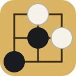

# AI GoGo

A Go game in a single HTML file. Each side picks an AI as its token — OpenAI,
Grok, Copilot, Meta, Gemini or Claude — and the stones carry that token. Play
against the computer, or with two people on one screen.

## Play

Open `index.html` in any browser. There is nothing to install or build.

To put it online, turn on GitHub Pages for this repository (Settings → Pages →
deploy from the `main` branch, root folder). The game will be served at
`https://<your-username>.github.io/<repo-name>/`.

## How it works

- Black moves first. Players take turns placing one stone on an empty point.
- A group of stones with no empty points next to it is captured and removed.
- You cannot play a stone that would have no liberties unless it captures, and
  you cannot repeat an earlier board position (the ko rule).
- Either player can pass. When both pass in a row, the game ends and is scored.
- Boards are 9 × 9, 13 × 13 or 19 × 19. Undo takes back the last move; against
  the computer it takes back the computer's reply as well.

## Scoring

The game uses area scoring: each side counts its stones on the board plus the
empty points only it surrounds. White gets 7.5 points of komi for moving
second.

When the game ends, the page guesses which groups are dead and fades them.
Tap any group to switch it between dead and alive, and the score updates.
Undo returns to play if you want to settle a position on the board instead.

## Modes

- **Pass and play** — two people share one screen and take turns.
- **You vs computer** — choose which colour the computer takes and how strong
  it plays:
  - **Quick** picks the move that does the most right now: captures, escapes
    and threats.
  - **Solid** plays out thousands of random games from the position for a
    little under a second and picks the move that wins most often.
  - **Sharp** does the same for about two and a half seconds.

The computer is a beginner-level opponent. It plays best on 9 × 9; on the
larger boards it has less time per point and is noticeably weaker.

Changing the mode, the board size or the computer's colour starts a new game.

## Tokens and logos

The built-in tokens are plain symbols, not the companies' logos. To play with a
real logo, choose "Use my own image" under either player and pick an image file
from your device. The image stays in your browser and is not saved or uploaded.

All product and company names are trademarks of their respective owners. This
project is not affiliated with or endorsed by any of them.

## Files

- `index.html` — the whole game: markup, styles, script and computer player
- `logo.svg` — repository logo and page icon
- `LICENSE` — MIT licence

## License

MIT. See `LICENSE`.
